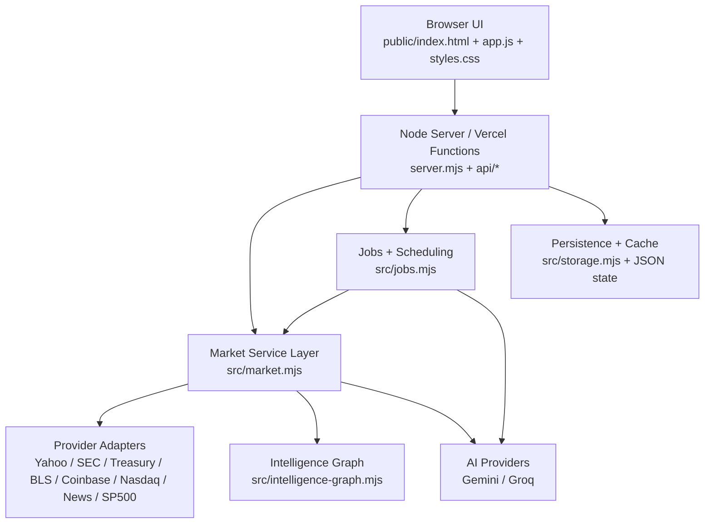

# Open Market Terminal

Open Market Terminal is a self-hosted market intelligence workspace built on public and free-to-access sources. It combines a live market desk, single-name research, sector drilldowns, company relationship mapping, alerts, saved workspaces, and a shared daily AI idea board in one terminal-style interface.

[Live Demo](https://open-market-terminal.vercel.app)  
[Security Policy](./SECURITY.md)

## Why this matters

Most retail-grade finance products split market monitoring, research, supply-chain context, filings, news, and workflow tools across multiple tabs and paid products.

Open Market Terminal pulls those workflows into one place:

- open the market with a heatmap, pulse board, flow monitor, and ranked catalysts
- drill into one company across price, filings, news, holders, board, and supply/customer links
- break sectors down into weighted boards, leaders, laggards, and constituent tables
- save layouts, notes, alerts, and AI-generated daily long/short boards for repeat use

The goal is not “copy Bloomberg marketing.” The goal is a serious, usable terminal-style product built on public infrastructure and transparent limitations.

## Quickstart

Run the app locally in under a minute:

```bash
cd /home/grads/keshavgoyal/open-market-terminal
cp .env.example .env
node server.mjs
```

Open `http://127.0.0.1:3000`.

For Docker:

```bash
cd /home/grads/keshavgoyal/open-market-terminal
cp .env.example .env
docker compose up --build
```

## Product Tour

### Market Desk

The opening screen for the session.

- cross-asset pulse board
- S&P 500 sector heatmap
- market-moving events
- watchlist monitor
- flow monitor
- rates and macro snapshot


### Quote Monitor

Single-name monitor for a live symbol.

- tape and quote summary
- interactive candlestick chart
- symbol-specific news
- event timeline
- filings
- options snapshot
- peers
- holders


### Research Lab

Deep single-name analysis workspace.

- research rail with symbols, pins, and sparklines
- security workbench
- relationship console
- screening and compare
- watchlist SEC events


### Company Map

Relationship-first view of one company.

- suppliers and upstream links
- customers and downstream channels
- corporate tree and deals
- competitors
- top holders
- board and officer listings
- insider ownership and transactions
- board interlocks
- index membership and timeline
- geographic exposure
- side-by-side company comparison
- full-screen relationship explorer


### Sector Explorer

Weighted drilldown into one S&P 500 sector.

- sector selector
- compact weighted board
- leaders and laggards
- sector headlines
- paginated constituent board
- overflow mosaic modal for additional names


### Monitor Boards

Multi-board scan page for broad market monitoring.

- leaders
- laggards
- most active
- unusual volume
- gap proxies
- sector performance
- ETF tape proxies
- macro board


### Newswire

Broad market wire plus focused search.

- general market news
- symbol/company/theme search
- linked sources
- source/category metadata
- pagination


### Event Calendar

Forward schedule for market-relevant dates.

- earnings
- macro releases
- policy events
- paging and time-window controls


### AI Ideas

Shared daily bullish/bearish board.

- S&P 500 universe
- 1-4 week horizon
- 20 bullish ideas
- 20 bearish ideas
- reasoning, risks, and confidence
- Gemini primary
- Groq fallback
- daily shared snapshot to reduce token burn


### Ops Center

Operational tools for running the desk itself.

- portfolio state
- alerts
- digests
- notes
- workspaces
- activity stream
- crypto panel


## What’s in the product today

### Market monitoring

- live quote boards from public sources
- S&P 500 heatmap with hover context
- market pulse cards across asset classes
- flow monitor for share volume, relative volume, short-interest context, and options availability
- rates and macro panel with Treasury curve and macro snapshot
- ranked market-moving events

### Research and intelligence

- interactive security workbench
- relationship console with `SPLC`, `REL`, `OWN`, `BMAP`, `RV`, `FA`, and `DES` style views
- company relationship graph
- supplier/customer/company-map explorer
- side-by-side company comparison
- sector drilldowns
- screeners and compare tables

### Workflow and persistence

- guest mode
- accounts and sessions
- saved preferences
- saved workspaces
- notes
- activity stream
- alerts and digests
- background jobs
- cache warming

### AI workflow

- scheduled daily snapshot
- hosted AI provider routing
- deterministic fallback when hosted AI is unavailable
- shared daily output instead of per-user reruns

## Architecture



## Tech Stack

- Node.js server runtime
- zero-build frontend in vanilla HTML, CSS, and JS
- serverless adapters for Vercel
- JSON-backed local persistence
- Docker and docker-compose support

## Data Sources

Current sources used by the app include:

- Yahoo Finance public endpoints
- SEC EDGAR / `data.sec.gov`
- U.S. Treasury daily yield curve data
- BLS public API and release calendar
- Federal Reserve FOMC calendar
- Nasdaq public earnings and index reference pages
- Coinbase Exchange public market data
- State Street SPY holdings
- Google News RSS
- Wikipedia fallbacks for constituent and benchmark reference data

## Deployment

### Local

```bash
node server.mjs
```

### Vercel

Required environment variables depend on what features you use. Common ones:

```env
SESSION_SECRET=replace-with-a-long-random-secret
APP_URL=https://open-market-terminal.vercel.app
SECURE_COOKIES=true
SEC_USER_AGENT=OpenMarketTerminal/0.2 your-email@example.com
GOOGLE_API_KEY=your_google_key
GROQ_API_KEY=your_groq_key
AI_PRIMARY_PROVIDER=gemini
AI_FALLBACK_PROVIDER=groq
AI_DAILY_TIMEZONE=America/New_York
AI_DAILY_HOUR=10
AI_DAILY_MINUTE=0
```

## Testing

```bash
npm test
```

## Security and disclosure

- This app is for informational and research workflows.
- Public-source coverage can be incomplete, delayed, or degraded.
- It is not a brokerage, execution platform, or investment adviser.
- See [SECURITY.md](./SECURITY.md) for vulnerability reporting.

## Roadmap direction

High-value next areas:

- deeper company-map expansion where public data supports it
- stronger quote monitor and sector workflows
- better persistence for shared serverless deployments
- richer AI consensus and provider-health reporting

## License

MIT License

Copyright (c) 2026 Keshav Goyal

Permission is hereby granted, free of charge, to any person obtaining a copy
of this software and associated documentation files (the "Software"), to deal
in the Software without restriction, including without limitation the rights
to use, copy, modify, merge, publish, distribute, sublicense, and/or sell
copies of the Software, and to permit persons to whom the Software is
furnished to do so, subject to the following conditions:

The above copyright notice and this permission notice shall be included in all
copies or substantial portions of the Software.

THE SOFTWARE IS PROVIDED "AS IS", WITHOUT WARRANTY OF ANY KIND, EXPRESS OR
IMPLIED, INCLUDING BUT NOT LIMITED TO THE WARRANTIES OF MERCHANTABILITY,
FITNESS FOR A PARTICULAR PURPOSE AND NONINFRINGEMENT. IN NO EVENT SHALL THE
AUTHORS OR COPYRIGHT HOLDERS BE LIABLE FOR ANY CLAIM, DAMAGES OR OTHER
LIABILITY, WHETHER IN AN ACTION OF CONTRACT, TORT OR OTHERWISE, ARISING FROM,
OUT OF OR IN CONNECTION WITH THE SOFTWARE OR THE USE OR OTHER DEALINGS IN THE
SOFTWARE.


## Star History

[](https://www.star-history.com/#keshavgoyal1744/Open-market-terminal&type=date&legend=top-left)
